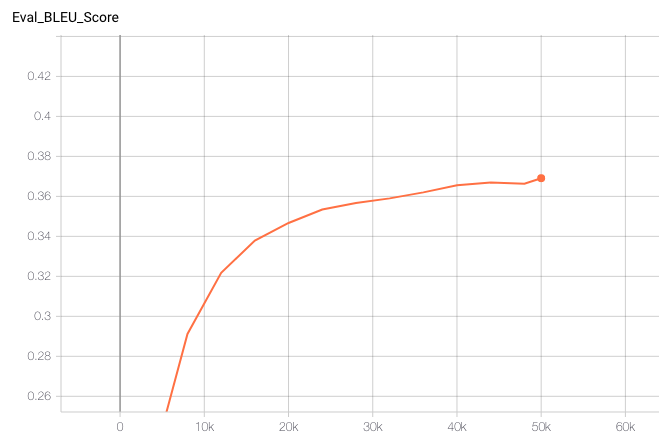
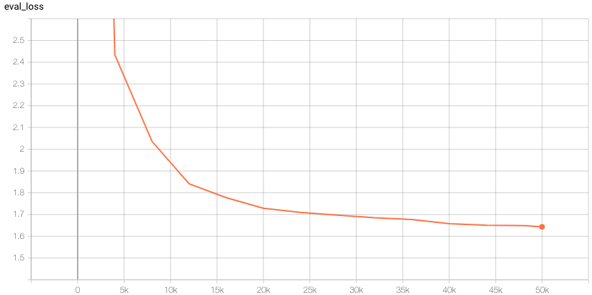
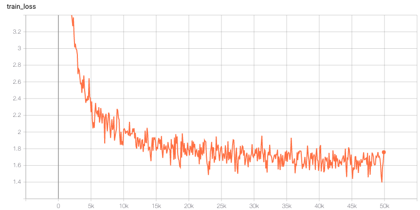
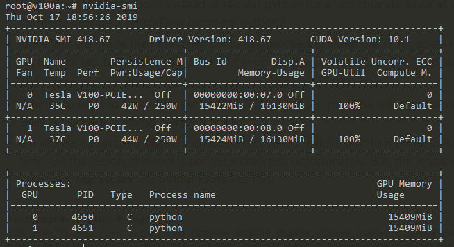
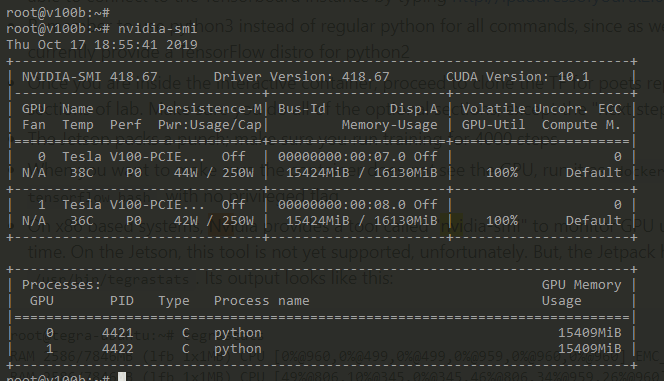
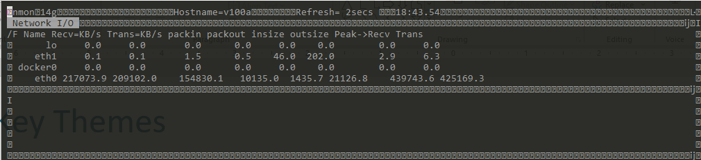
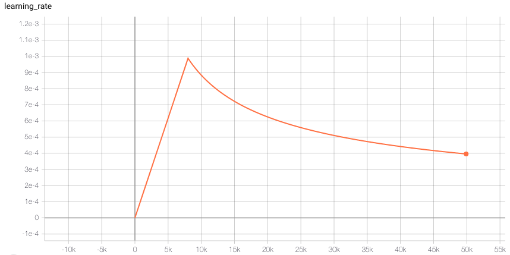
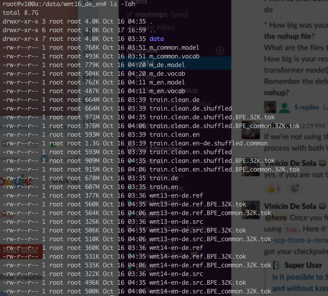
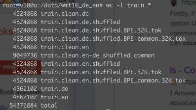

## Homework 9 ##

How long does it take to complete the training run? (hint: this session is on distributed training, so it will take a while)

**ANS:  50k step in 22 hours, 12 minutes, 10 seconds (according to Tensorboard)**


Do you think your model is fully trained? How can you tell?

**ANS: The model is getting close to being fully trained at 50K steps as its BLEU score is 0.3691 and the example with 300k steps
had a BLEU score of 0.380.**



Were you overfitting?

**ANS: No. Both Eval and Training Losses are consistently decreasing.
If the model was overfitting we would see a divergence.**






Were your GPUs fully utilized?

**ANS: Yes. All Cores of Both GPUs at each node was 100%
utilized**





Did you monitor network traffic (hint: apt install nmon ) ? Was network the bottleneck?

**ANS: Yes. I did monitor the network.  The eth0 network was receiving and transmitting around 200 Mb/s of data each way,
or a total of 400Mb/s and the network is configured for 1000 Mb/s (1Gb/s). The network was not the bottleneck.  
Given that all GPUs were running at 100% it is likely that the GPUs where the bottleneck in this run.**



Take a look at the plot of the learning rate and then check the config file. Can you explan this setting?

**ANS: The learning rate policy has 8000 warmup steps before it will begin training with the set learning rate.
During the warmup phase, the learning rate is slowly increased from zero in very small, linear increments of 0.0001**

```angular2
  "lr_policy": transformer_policy,
  "lr_policy_params": {
    "learning_rate": 2.0,
    "warmup_steps": 8000,
    "d_model": d_model,
  },
```



How big was your training set (mb)? How many training lines did it contain?

**ANS: All of the data in the referenced data director was 8.7G. The data consisted of both english and german sentences (train.en - 607Mb) and (train.de - 678Mb) for a total of 
1.3GB. This data was cleaned and tokenized resulting in two files that were used in the model 
(train.clean.en.shuffled.BPE_common.32K.tok - 915M and train.clean.de.shuffled.BPE_common.32K.tok - 976Mb or 1.89Gb)
The data had the following line count:**
- train.clean.de : 4524868
- train.clean.de.shuffled.BPE_common.32K.tok : 4524868
- train.clean.en : 4524868
- train.clean.en.shuffled.BPE_common.32K.tok : 4524868
- train.de : 4562101
- train.en : 4562101


```angular2
train_params = {
  "data_layer": ParallelTextDataLayer,
  "data_layer_params": {
    "pad_vocab_to_eight": True,
    "src_vocab_file": data_root + "m_common.vocab",
    "tgt_vocab_file": data_root + "m_common.vocab",
    "source_file": data_root + "train.clean.en.shuffled.BPE_common.32K.tok",
    "target_file": data_root + "train.clean.de.shuffled.BPE_common.32K.tok",
    "delimiter": " ",
    "shuffle": True,
    "shuffle_buffer_size": 25000,
    "repeat": True,
    "map_parallel_calls": 16,
    "max_length": 56,
  },
}
```





What are the files that a TF checkpoint is comprised of?

**ANS: The TF checkpoint has the following files:**

- data file : variable weights/values 
- index file : key-value index of tensors
- meta file : saved graph structure of the model

How big is your resulting model checkpoint (mb)?

**ANS: A Checkpoint is about 829MB**
```angular2
(base) Marcuss-iMac:~ mastreips$ ls -lah model.ckpt*
-rw-r--r--  1 mastreips  staff   813M Oct 18 13:31 model.ckpt-50000.data-00000-of-00001
-rw-r--r--  1 mastreips  staff    35K Oct 18 13:24 model.ckpt-50000.index
-rw-r--r--  1 mastreips  staff    15M Oct 18 13:24 model.ckpt-50000.meta
```

Remember the definition of a "step". How long did an average step take?

**ANS: ~1.6 seconds**
```angular2
*** Global step 3200: ***     Train loss: 2.7368 
time per step = 0:00:1.617

*** Global step 33300: ***     Train loss: 1.6769 
time per step = 0:00:1.593

*** Global step 44500: ***     Train loss: 1.8160 
time per step = 0:00:1.595
```

How does that correlate with the observed network utilization between nodes?

**ANS:The network was sending and receiving about 200 Mb/s each way, or 400 Mb/s. Each 1.6 second step means that about 
700Mb/s of data are being processed for at each step.**